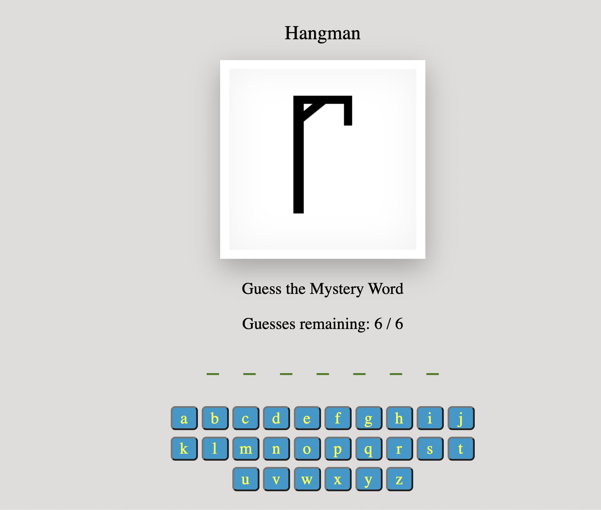
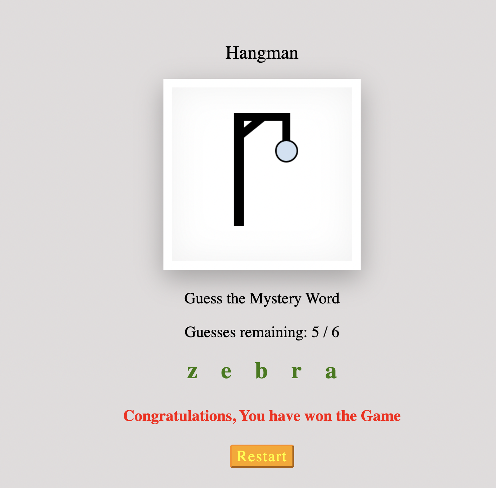
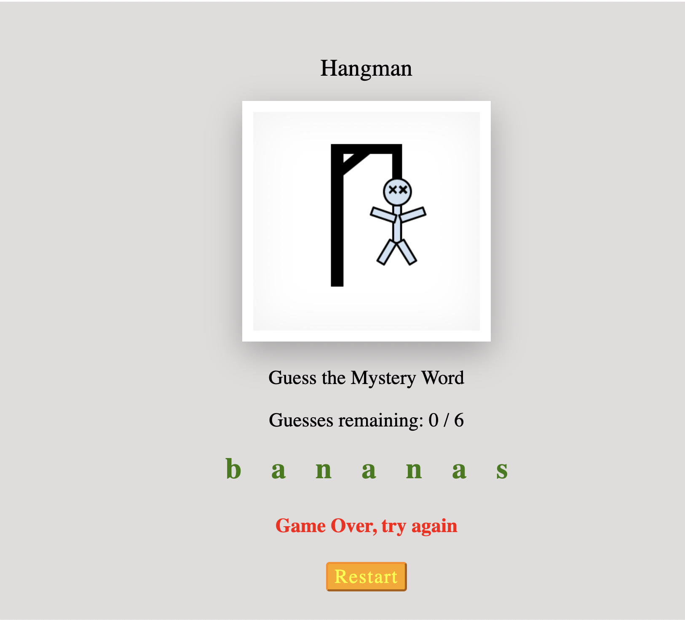

# enmeraz.github.io

## Description:
I created a simple react app that deployes the game Hangman. In this game we have to guess the mystery word (the empty green spaces shown blow). 

    

Next, the player will click on a letter to see if he can guess the mystery word. The player will have 6 guesses before the man is hung. Once all the letters have been guessed correctly, before the man is hung, then a message will be displayed telling the user that they have won. If the man is hung then the game will be over and the user loses. 

It will then show the mystery word completed. If the player doesn't want to play then the game will be over. However if the user presses the restart button, the game will start again but with a new mystery word (just like how the first picture looks). 

    
    

***
### website: 
https://enmeraz.github.io/enmeraz-hangman/
### github repository: 
https://github.com/enmeraz/enmeraz-hangman

***
## How to build and run
### To run:
npm start or visit website